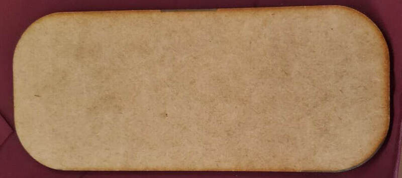
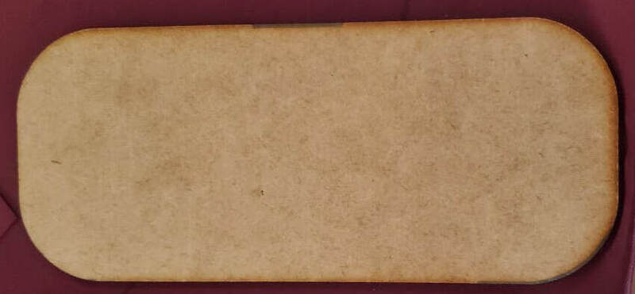
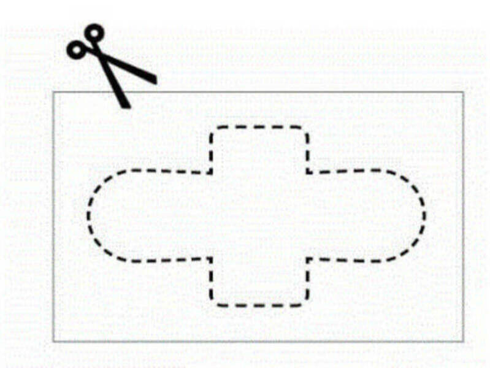
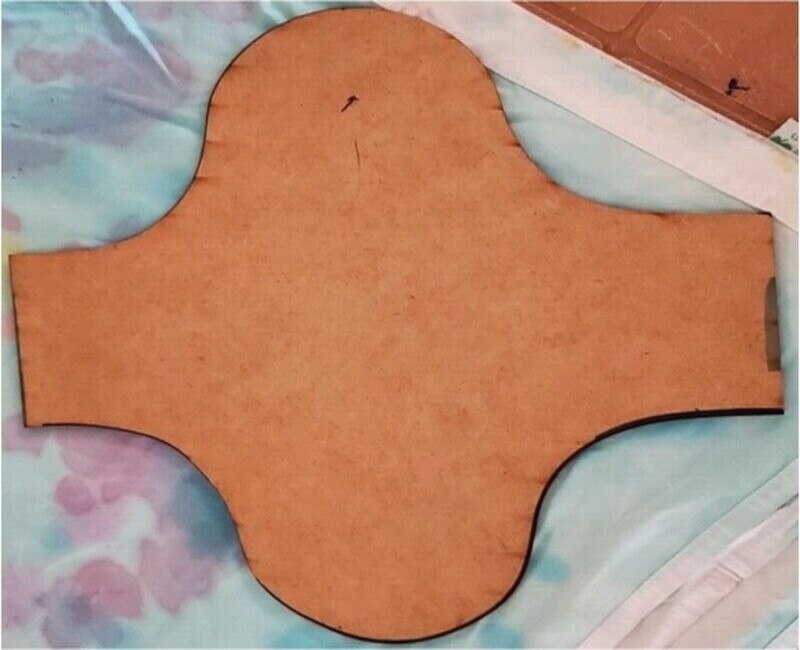
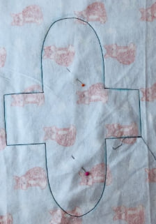
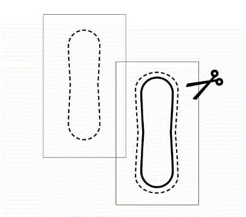
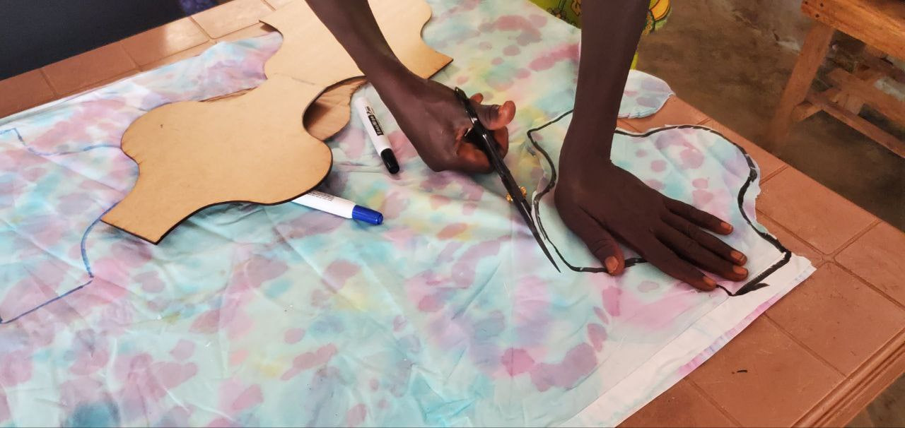
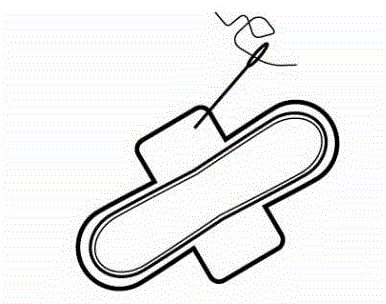

# REUSANBLE SANITARY PADS MAKING

Reusable Sanitary Pads are cloth pads that can be used several times. They absorb the menstrual blood and the pad should stay for about 4-5 hours depending on your menstrual flow. After use, you need to wash the cloth really well and remove every stain of blood and then you can reuse the same pad. These cloth pads are usually made in several layers. 

## Description 
The product consists of a top layer that comes in direct contact with the body, a transfer layer followed by an absorbent material whth absorb menstrual blood and other fluids, a leakproof layer at the bottom, and an adhesive coating at the back of leakproof layer for fixing to the panties, which prevents dislocation when worn.

The pad has wings so that it can be attached to the panties. The upper layer (top layer) is a woven or non-woven material with sufficient porosity to meet the absorbency requirements. The materials for the top layer may include polyester, polyethylene or polypropylene or their blend, cotton, viscose/rayon etc. The middle absorbent layer is made of cellulosic material and the outer layers are made of plastic. 

The absorbent layer can be mixed with super-absorbent polymers to enhance absorption and thin the pad. The lower leakproof layer including the wings is made of plastic such as polyethylene/ polypropylene

## Learning Objective 
* They offer women and girls an affordable and environmentally friendly alternative
* To provide employment to women seamstresses who manufacture the product.
* Equipping the participants with skills in making sanitary pads using locally available materials.

## Tools & Materials
### Tools
- Scissors - sharp enough to cut through fabric
- Measuring tap
- Sewing Machine
- Pins/clips
- Chalk or water-soluble marker pen/ pen
- Thread
- Table
- A ruler
- Fly wood/box
- Needles
- Pencil and a paper

### Materials
- A button /Snaps
- A piece of light, flexible plastic, like a plastic bag
- A piece of clean, absorbent material, like cotton
- A piece of fabric

## Step-by-Step Guide / Instructions 
### Step one
Identify and select the tools and materials required.

### Step two
Make your pad template (You can use paper, box, or fly wood for making the template/pad cutting guide) 
* Make one to help in cutting the piece of cotton into a long shape with rounded ends like in the pictures below 15cm X 29cm

* Make the second one to help in cutting the plastic piece and it should be slightly larger than the cotton piece it should be 16cm X 30Ccm.
* 

* Make the third one to help in cutting the fabric and make sure it’s longer than the previously cut pieces and with wings on the edges of the long sides

                         
  
### Step three
With the help of the templates/pad cutting guide, Use the soluble pen/marker to make drawings/sketches of the pad on the fabric, plastic, and the cotton piece as well. Do the same experiment with all the pads you want to make

### Step four
Cut
* You can now cut the piece of cotton using the smallest long shape with rounded ends.  
* Then cut the plastic piece which is slightly larger than the cotton piece.

  

   
* Lastly, cut the pieces with wings on the edges of the long sides.
  
 

 
 
### Step five
Put the cotton piece and the plastic piece together evenly and secure it with pins/clips, thread your needle and sew the cotton piece to the plastic piece all round
 
 

#### Step six
Sew that combined piece to the fabric piece, the cotton side facing outward and the plastic side between the fabric and cotton.

 

  
  
### Step seven
On the edge of one of the wings, sew the button on and on the opposite wing of the edge, cut a small, narrow hole for the button to fit through. Or sew Velcro on the wings instead of buttons

 

 

To wear the reusable sanitary pad, place it in your underwear, wrap the wings under, and use the button to secure in place.

 

## #ASKnet Logo 

## Participants
** Max. Participants:** 30

** Min. Trainers:** 2

## Credits, References and Resources  
Links (e.g. to videos), references, etc.

Title: How to make reusable menstrual pads

URL: https://youtu.be/cZtPLyj_EiA

## Additonal information for this template
Find the related Wiki for this template [here](https://github.com/ASKnetCommunity/OER_documents_template/wiki) (this is how you embed links)  

For further information about GitHub visit: [ASKnet GitHub Guidance](https://asknet-open-training.github.io/Github-Guidance/) 

This document is written by using markdown syntax. Clicking on the `Pen Icon` will open the Editing mode, which depict the markdown syntax.

For more informations about basic writing and formatting syntax please visit [GitHub: formatting syntax](https://docs.github.com/en/get-started/writing-on-github/getting-started-with-writing-and-formatting-on-github/basic-writing-and-formatting-syntax)

